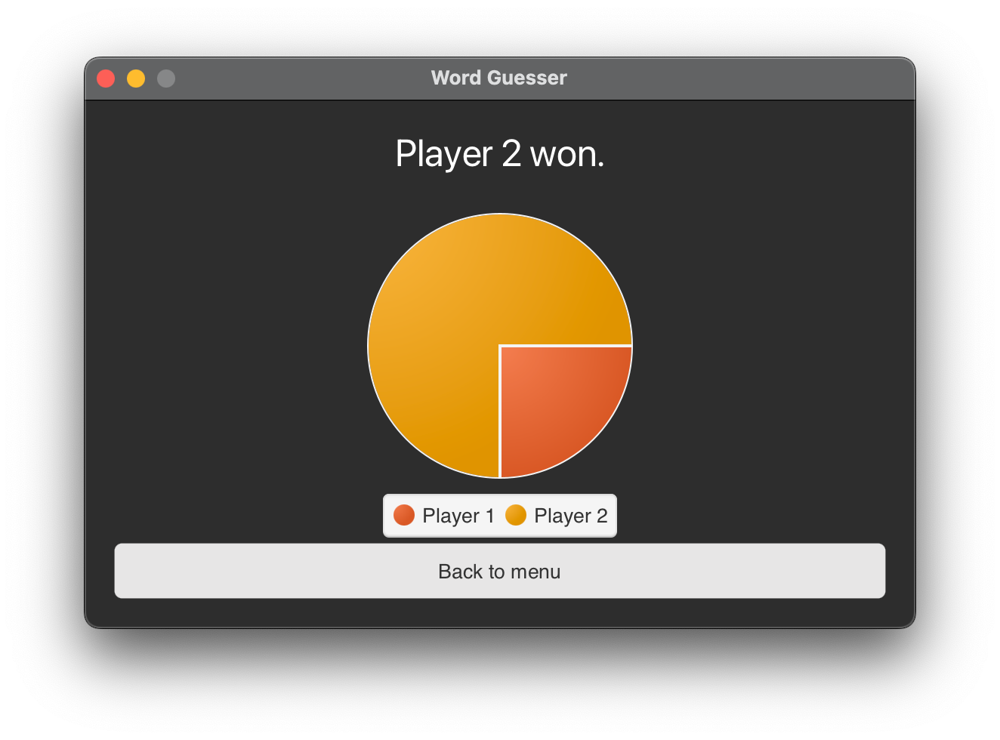

# Word Guesser

<h2 align="center">
    A simple two-player word-guessing game.
</h2>

> In "Word Guesser" one player gives a word that the other player needs to guess. The player may enter single letters to
> find the word. However, the round ends if the player enters too many characters which are not in the word.

***

## Table of Contents

1. [The Gameplay](https://github.com/GregorGott/Word-Guesser#the-gameplay)
2. [Download Word Guesser](https://github.com/GregorGott/Word-Guesser#download-word-guesser)
3. [Install Word Guesser](https://github.com/GregorGott/Word-Guesser#install-word-guesser)
4. [The Points System](https://github.com/GregorGott/Word-Guesser#the-points-system)
5. [Images](https://github.com/GregorGott/Word-Guesser#images)

## The Gameplay

You can set the number of questions and the maximum mistakes in the main menu. After that, the round starts directly.
Player 1 enters a word, and Player 2 tries to guess it. After that, the players change, and player 2 gives a word etc.
In the end, the winner is the one who has guessed the longest words.

## Download Word Guesser

> ⚠️ Word Guesser is currently a Beta. It can contain bugs and unfinished features.

If you want to play this game on a desktop device, just download the correct version for your operating system.

**Download for
Windows: [Download msi](https://github.com/GregorGott/Word-Guesser/releases/download/v1.0.0-beta.1/Word-Guesser-win-x86_x64.msi)**  
**Download for Linux: (Coming Soon)**  
**Download for macOS (
Intel): [Download dmg](https://github.com/GregorGott/Word-Guesser/releases/download/v1.0.0-beta.1/Word-Guesser-mac-x86_x64.dmg)**

Right after the download, you can start the game and have fun.

## Install Word Guesser

### Install Word Guesser on Mac

To install Word Guesser on a Mac, just open the downloaded dmg file. Then drag Word Guesser to your Applications folder.
When you start Word Guesser for the first time you get an alert, that the developer is unknown. To start Word Guesser
anyway, right-click on Word Guesser and click on open. Now you can start Word Guesser from everywhere on your Mac.

### Install Word Guesser on Windows

Open the downloaded .msi file. Windows will warn you that the developer is unknown, press "Yes" to install Word Guesser.
After a few seconds, Word Guesser is installed, and you can start it from your Windows Menu.

## The Points System

For every guessed word the player gets a point. If the player can not guess the word, he loses the points. Example:
Player 1 gives the word "Caretaker". Player 2 enters "C" and "A" and receives two points. If player 2 enters "Y" he does
not get a point and keeps his two points. If he guessed all words he gets 6 points.

|C|A|R|E|T|A| K |E|R|
|-|-|-|-|-|-|--------|-|-|
|1|2|3|4|5|<b>2</b>|6|<b>4</b>|<b>3</b>|

## Images

  
   
  
  

## License

GNU General Public License v3.0: https://www.gnu.org/licenses/quick-guide-gplv3.html
