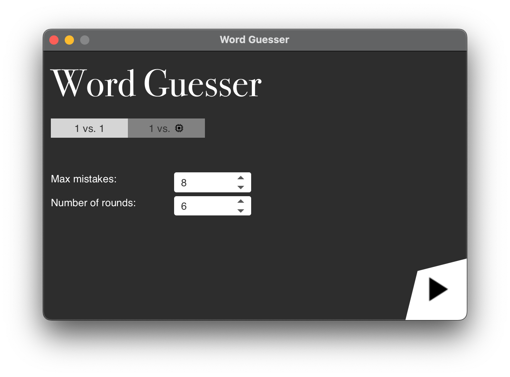

# Word Guesser

<h2 align="center">
    A simple two-player word-guessing game.
</h2>

>In "Word Guesser" one player gives a word, which the other player needs to guess. The player may enter single letters to find the word. However, if the player enters too many characters, which are not in the word, the round ends.

## The Gameplay
In the main menu, you can set the number of questions and the maximum mistakes. After that, the round starts directly. Player 1 enters a word and Player 2 tries to guess it. After that, the players change and player 2 gives a word, etc. In the end, the winner is the one who has guessed the longest words.

## Where to Begin
If you want to play this game on a desktop device just download the correct version for your operating system.

**Download for Windows: (Coming Soon)**  
**Download for Linux: (Coming Soon)**  
**Download for macOS: (Coming Soon)**

Right after the download you can start the game and have fun.

>**Information for developers:** Word Guesser is developed on IntelliJ IDEA CE. I did not try to open and run this project on Eclipse.

## The Points System
For every guessed word the player gets a point. If the player can not guess the word, he loses the points. Example:
Player 1 gives the word "Caretaker". Player 2 enters "C" and "A" and receives two points. If player 2 enters "Y" he does not get a point and keeps his two points. If he guessed all words he gets 6 points.

|C|A|R|E|T|A|    K   |E|R|
|-|-|-|-|-|-|--------|-|-|
|1|2|3|4|5|<b>2</b>|6|<b>4</b>|<b>3</b>|

## Images

  
   
  
  

## License
GNU General Public License v3.0: https://www.gnu.org/licenses/quick-guide-gplv3.html