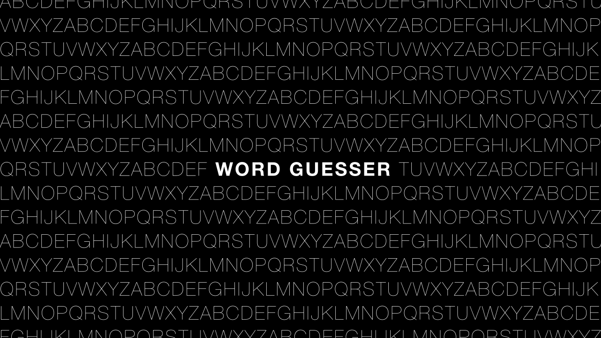
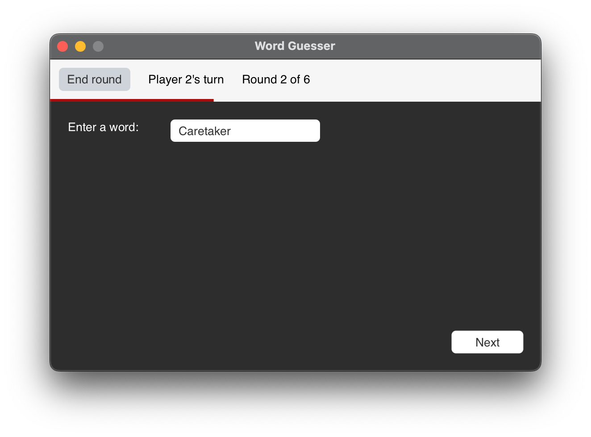

# Word Guesser

<h2 style="text-align: center;">
    A simple two-player word-guessing game.
</h2>

> In "Word Guesser" one player gives a word that the other player needs to guess.
> The player may enter single letters to find the word. However, the round
> ends if the player enters too many characters which are not in the word.

***

## Table of Contents

1. [The Gameplay](https://github.com/GregorGott/Word-Guesser#the-gameplay)
2. [Download Word Guesser](https://github.com/GregorGott/Word-Guesser#download-word-guesser)
3. [Install Word Guesser](https://github.com/GregorGott/Word-Guesser#install-word-guesser)
4. [The Points System](https://github.com/GregorGott/Word-Guesser#the-points-system)
5. [Images](https://github.com/GregorGott/Word-Guesser#images)
6. [License & Developer Information](https://github.com/GregorGott/Word-Guesser#license-&-developer-information)

## The Gameplay

You can set the number of questions and the maximum mistakes in the main menu.
After that, the round starts directly. Player 1 enters a word, and Player 2
tries to guess it. After that, the players change, and player 2 gives a word etc.
In the end, the winner is the one who has guessed the longest words.

## Download Word Guesser

Just download the correct version for your operating system. Right after the download, you can start the game and have
fun.

### Stable Release 1.0.0

**Download for
Windows: [Download exe](https://github.com/GregorGott/Word-Guesser/releases/download/v1.0.0/Word-Guesser-win-x86_x64.exe)**  
**Download for macOS (Intel): [Download dmg](https://github.com/GregorGott/Word-Guesser/releases/download/v1.0.0/Word-Guesser-mac-x86_x64.dmg)**

### Beta Release 1.1.0 Beta 1

**Download for
Windows: [Download exe](https://github.com/GregorGott/Word-Guesser/releases/download/v1.1.0-beta.1/Word-Guesser-win-x86_x64.exe)**  
**Download for macOS (Intel): [Download dmg](https://github.com/GregorGott/Word-Guesser/releases/download/v1.1.0-beta.1/Word-Guesser-mac-x86_x64.dmg)**

## Install Word Guesser

### Install Word Guesser on Mac

1. Dwonload the _dmg_ file.
2. Open the downloaded file.
3. Drag "Word Guesser" to your _Applications_ folder.
4. Open Finder and go to "Applications".
5. Search for "Word Guesser" and make a right-click on it.
6. Click on _Open_ and confirm.

When you start Word Guesser **for the first time**, you need to click "Open" twice,
because of the Mac security settings.

### Install Word Guesser on Windows

1. Download the _exe_ file.
2. If you get an alert that the developer is unknown, click on "Open".
3. The installation starts.

Now you can find Word Guesser in your Windows Menu.

## The Points System

For every guessed word the player gets a point.
If the player can not guess the word, he loses the points. Example:
Player 1 gives the word "Caretaker". Player 2 enters "C" and "A" and receives two points.
If player 2 enters "Y" he does not get a point and keeps his two points.
If he guessed all words he gets 6 points.

| C   | A   | R   | E   | T   | A        | K   | E        | R        |
|-----|-----|-----|-----|-----|----------|-----|----------|----------|
| 1   | 2   | 3   | 4   | 5   | <b>2</b> | 6   | <b>4</b> | <b>4</b> |

## Images

  
   
  
  

## License & Developer Information

### Developer Information

This project uses Modern-Dialog-Windows. Check it out [here](https://github.com/GregorGott/Modern-Dialog-Windows).

### License

GNU General Public License v3.0: https://www.gnu.org/licenses/quick-guide-gplv3.html

Please notice that the images are contributed under another license.
You can find more
information [here](https://github.com/GregorGott/Word-Guesser/blob/beta/src/main/resources/com/gregorgott/guesser/images/LICENSE.txt)
.
